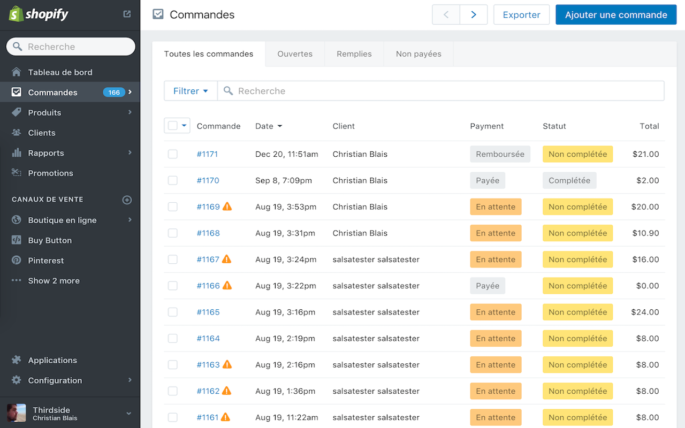

# Shopify Admin Translator

### What is this?
Shopify Admin Translator is a small chrome extension that tries to translate as much as it can from the Shopify Admin in different languages. It works by using standardized CSS selectors to select part of the application, translating them on the fly based on your selected language using simple javascript rules.



### Who is this for?
This is best used by Shopify merchants for which English isn't their primary language. If you're a Shopify Partner or Expert who'd like to help or sell Shopify to non-English merchants, feel free to use this app as well, free of charge.

### Does it translate everything?
No. Shopify Admin is huuuge, and evolve on a daily basis. It's impossible for us to keep track of all new strings, all new texts that are added daily. That being said, we believe this translates enough to still be useful, and we'll always default to the original text if we can't find a translation so you don't lose anything.

### How does this work?
Shopify Admin Translator relies on pattern matching to find snippets of text, replacing them with some well defined rules. Imaginine the following;

```javascript
// tree.js
{
  '.next-nav': {
    '.next-nav__panel--primary': {
      '[data-nav-section]': {
        '.next-nav__text': 'general.sections.$data-nav-section.$text'
      }
    }
  }
}
```

This instructs the parser to;

1) Find all html elements with a `next-nav` class;
2) Within those, find all elements with a `next-nav__panel--primary` class;
3) Within those, find all elements with a `data-nav-section` attribute;
4) Within those, find all elements with a `next-nav__text` class;
5) For all of them, replace the inner text with *something*.

Now, how do we define that *something*? The parser uses a smart combination of namespaces, variables and keys to determine how the text should be replaced. In the above example, `general.sections.$data-nav-section.$text`, we see a couple of things;

- `general`, `section`
Those are namespaces. We use them to keep translated strings in logical groups.

- `$data-nav-section`
All elements starting with a `$` represents a variable. Every time we instruct the parser to find elements based on an attribute, the parser keeps track of the value of that attribute, making it available for further usage through a `$` variable, using the name of said attribute.

- `$text`
This one is a special variable representing a sanitized representation of the inner text of the current element. Spaces and special characters are all stripped out, making them suitable for the parser to use as keys. As an example, "Hello, world" would be sanitized as "hello-world".

So to go back to our `general.sections.$data-nav-section.$text` example, we instruct the parser to;

1) Within the `general` namespace;
2) Within the `sections` namespace;
3) Within a namespace named after the `[data-nav-section]` attribute value;
4) Within a namespace named after the current text;
5) Return the translated string.

All translations sit in javascript files using a format that allow the parser to follow those instructions and find the proper translated string.

```javascript
// locales/fr.js
{
  'general': {
    'sections': {
      'section-1': {
        'order': "Commande",
        'draft': "Pré-Commande"
      },
      'section-2': {
        'checkout': "Panier",
        'customer': "Client"
      }
    }
  }
}
```

